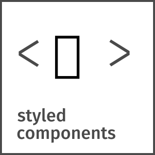

<h1>
 
  My Profile
 
</h1>

⚡ I'm currently working on my portfolio, migrating from vanilla JavaScript to a combination of React and Vite. Also, I am implementing a backend using PHP and Laravel to get data from the Google Analytics API. This will allow me to display the number of visits on the frontend of my page.

🌱 I am also developing a web application that will allow users to quickly generate professional resumes. I use native JavaScript to provide a fast and efficient experience. Additionally, I am taking advantage of local storage to ensure users can conveniently save and access their resumes. 

💭 My goal is to continually improve my portfolio and technical skills, and I am excited for the opportunity to demonstrate my capabilities through these projects. I am committed to providing innovative and functional technology solutions.

~~😄 Fun fact~~: Recently, I have faced technical and financial challenges that have significantly delayed my progress. To overcome these difficulties, I currently work as a receptionist on the night shift, with the aim of raising funds to improve the components of my computer so that I can invest in a Hostinger hosting plan, where I will host the websites of my future clients, while I continue to expand. my skills and building professional relationships.

Despite the current obstacles, I am committed to further advancing my professional development.

<!-- REDES SOCIAIS -->
	
    
   	
	</a>
   	

<!--  -->

<h2 align="center">Stack</h2>

      

| Tools | Libs | Desing |
| - | - | - |
|         |    |       |

| Frameworks | Databases | Cloud | Services| Security |
| - | - | - | - | - |
|        |         |       |      |    |

	<h2>Certifications</h2>
	
	

<!--  -->
